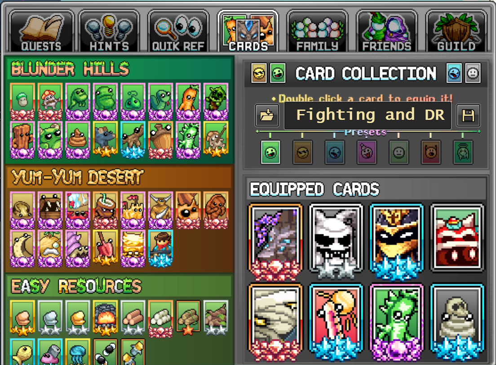
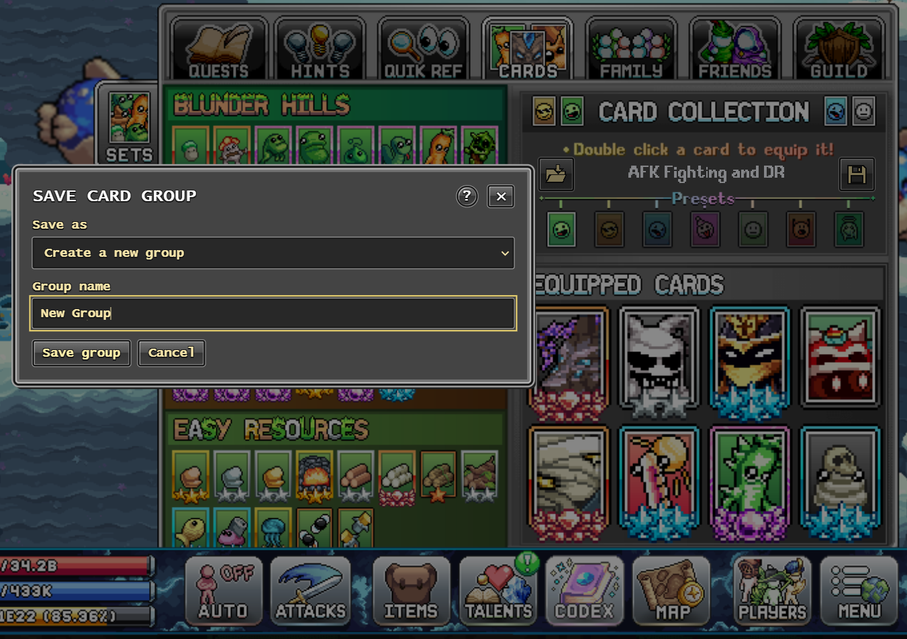
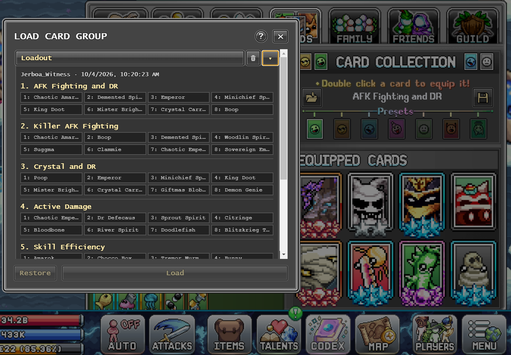

# Idleon Card Profiles

Give your card presets names and save whole groups of card setups to use across your characters.

For **Idleon on Steam, Windows x64**. Version **0.1.2**, unofficial test build.

## Setup

1. [Download the installer](https://github.com/stack-junkie/idleon-card-profiles/releases/download/v0.1.2/IdleonCardProfiles-Setup.exe).
2. Exit Idleon normally, then fully exit Steam using **Steam > Exit**.
3. Run the installer and click **Install**. If already installed, click **Repair / update**.
4. Open Steam and click Idleon's usual **Play** button. The installer's **Play** button and desktop shortcut also launch through Steam.

Setup connects the add-on to Steam automatically for your most recently used Steam account. Everything needed is included. No commands, launch-option copying, or separate software installs.

The installer is unsigned, so Windows may show a warning. Only download it from this repository. Automatic Steam setup and launch have been tested on an existing installation; a first-time install on a clean Windows account is still unverified.

Another Steam account or existing launch options?

To enable another account, sign into it in Steam, exit Steam, then use **Steam Setup** in the Windows Start menu and click **Enable / repair**.

Setup preserves ordinary game launch arguments and saves the previous setting for uninstall. If Idleon already uses another custom launcher, setup will ask you to resolve that first.

## How to use

Open **Codex > Cards** in the game.

**Name a preset:** Double-click its name above the preset row. Type a name and press **Enter**. **Escape** cancels. Each character keeps its own names.

**Save a group:** Click the **floppy disk** on the right. Give the group a name and save. A group includes **all available card presets**, their names, and their cards.

**Load a group:** Click the **folder** on the left. Click the group's **name** to select it, then click **Load [group name]**. This replaces the current character's preset names and cards. The card-set bonus stays unchanged.

The arrow expands a group's details without selecting it. In the picture below, the group is expanded but not selected, so **Load** is still disabled.

- **Undo a load:** Click **Restore** in the Load window. It restores that character's previous setup, retained across restarts until another load or restore replaces it.
- **Delete a group:** Click its trash icon and confirm. This deletes the saved group, not setups already loaded onto characters.

Use the **?** button for extra help. Saved groups are shared between compatible characters on your account, but stay on this PC.

Game updates, saved data, and uninstalling

An unsupported game update blocks the add-on. You can still play normally through Steam; first clear the Card Profiles Launch Option if you set it.

Saved names and groups live in `%LOCALAPPDATA%\IdleonCardProfiles`. Back up that folder to keep a copy. They do not sync through Steam Cloud.

To uninstall, exit Idleon and Steam, then uninstall **Idleon Card Profiles** through Windows Apps. Uninstall restores the previous Steam setting for accounts configured by setup. Saved profiles are kept.

[Technical details and test status](docs/technical-notes.md) · [Contributing](CONTRIBUTING.md) · [Changelog](CHANGELOG.md) · [Security](SECURITY.md) · [License](LICENSE)
